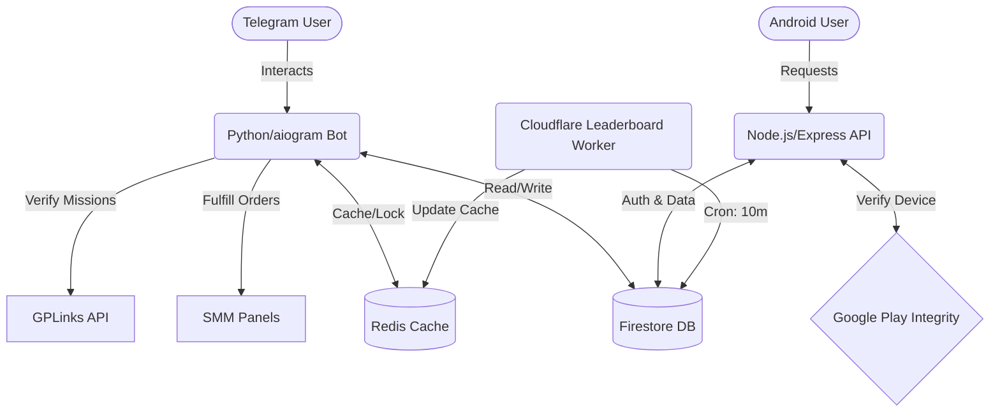

<div align="center">
  <h1>InstaVault ⚡</h1>
  <p><em>The ultimate Telegram & Android ecosystem for earning and spending virtual engagement sparks.</em></p>

  [](https://www.python.org)
  [](https://nodejs.org/)
  [](LICENSE)
  [](https://firebase.google.com/)
  [](https://redis.io/)
</div>

> **InstaVault** empowers users to earn Sparks (⚡) through missions and redeem them for real Instagram engagement via integrated SMM panels.

---

<details>
<summary><strong>Table of Contents</strong></summary>

- [Features](#✨-features)
- [System Architecture](#🏗-system-architecture)
  - [Architecture Diagram](#architecture-diagram)
  - [Component Breakdown](#component-breakdown)
  - [Database Schema](#database-schema)
- [Getting Started](#⚙️-getting-started)
  - [Prerequisites](#prerequisites)
  - [Environment Variables](#environment-variables)
  - [Local Development Setup](#local-development-setup)
- [Deployment](#🚀-deployment)
- [Troubleshooting](#🔧-troubleshooting)
- [Contributing](#🤝-contributing)
- [License](#📄-license)

</details>

---

## ✨ Features

- **🤖 Interactive Telegram Bot:** A seamless onboarding experience with multi-step flows and instant engagement.
- **📱 Secure Android API:** Connects the Android Client to the ecosystem using Google Play Integrity API to ensure device authenticity.
- **💸 Virtual Economy:** Earn "Sparks" through missions (e.g., Shortlink URL tasks) and spend them on engagement packages.
- **⚡ High-Speed Leaderboards:** Cloudflare Worker seamlessly syncs top users to Redis for lightning-fast leaderboards.
- **🛡 Robust Security:** Implements anti-replay nonces, cache-aside patterns, rate limits, and an in-memory ban system.
- **🛠 Comprehensive Admin Panel:** View live analytics, broadcast messages, adjust user balances, and manage APK versions directly from Telegram.

---

## 🏗 System Architecture

### Architecture Diagram



### Component Breakdown

1. **Telegram Bot (`src/instavault`)**: Built on `aiogram`. Uses webhook mode for production and polling for development. Manages state via Finite State Machines (FSM) and interfaces with external SMM panels.
2. **API Server (`app_server`)**: A secure Express/TypeScript backend for the Android app. Uses `X-Vault-ID` and Play Integrity tokens to issue secure UUIDv4 sessions. Handles dual-writing for telemetry audit logs.
3. **Database Layer (`database`)**: A dual-layered setup using **Firestore** for persistent, transactional, and immutable data (like economy logs), and **Redis** for ephemeral data, rate-limiting, and analytics caching.
4. **Cloudflare Worker (`worker-leaderboard`)**: A lightweight cron job running on the edge, offloading heavy leaderboard calculations from Firestore to Redis every 10 minutes.

### Database Schema

*   **Firestore Collections:**
    *   `users`: Core profile, balances (`spark_balance`), rankings, and timestamps.
    *   `orders`: SMM Panel views-orders.
    *   `transactions`: Append-only, immutable ledger for all economic movements.
    *   `audit_logs`: Telemetry records from Android clients.
*   **Redis Namespaces:**
    *   `user:{user_id}`: Profile cache (24h TTL).
    *   `leaderboard:lifetime`: Top 10 users JSON payload.
    *   `stats:shortener:*`: Counters and Unique User tracking (HyperLogLog).

---

## ⚙️ Getting Started

### Prerequisites

- **Python** 3.10+
- **Node.js** v18+ & **npm**
- **Redis** Instance (Local or Upstash)
- **Firebase Project** (Firestore configured, Service Account JSON exported)
- **Cloudflare** Account (for Wrangler/Workers)

### Environment Variables

Copy the structure below to a `.env` file at the root of the project:

```env
# --- Telegram Bot ---
BOT_TOKEN=your_telegram_bot_token
BOT_PORT=8099
WEBHOOK_URL=https://your-domain.com/webhook
ADMIN_IDS=123456789,987654321
APP_ENV=development

# --- Firebase ---
FIREBASE_CREDENTIALS_PATH=./firebase_credentials.json

# --- Redis ---
REDIS_URL=redis://localhost:6379
UPSTASH_REDIS_REST_URL=https://your-upstash-url
UPSTASH_REDIS_REST_TOKEN=your-upstash-token

# --- External Services ---
SMM_API_URL=https://panel-url.com/api/v2
SMM_API_KEY=your_smm_key
GPLINKS_API_URL=https://api.gplinks.com/api
GPLINKS_API_KEY=your_gplinks_key
```

### Local Development Setup

1. **Python Bot**:
   ```bash
   make install
   make run
   ```

2. **Node.js API Server**:
   ```bash
   cd app_server
   npm install
   npm run dev
   ```

3. **Cloudflare Worker**:
   ```bash
   cd worker-leaderboard
   npm install
   # Run local dev server
   npx wrangler dev
   ```

---

## 🚀 Deployment

### 1. API Server (Production)
For production, run the API server using a process manager like `pm2`:
```bash
cd app_server
npm install
npm run build # (if applicable) or use ts-node/tsx in prod
NODE_ENV=production pm2 start server.ts --name instavault-api
```
*(Ensure `NODE_ENV=production` so that Google Play Integrity verification is strictly enforced).*

### 2. Telegram Bot (Webhook Mode)
In production, the bot operates via webhooks for efficiency.
*   Setup a reverse proxy (e.g., Nginx) to forward traffic from `https://your-domain.com/webhook` to the bot's local `BOT_PORT`.
*   Ensure your domain has a valid SSL certificate (e.g., via Let's Encrypt), as Telegram requires HTTPS.

### 3. Cloudflare Worker
Deploy the leaderboard syncing worker directly to Cloudflare's Edge:
```bash
cd worker-leaderboard
npx wrangler deploy
# Securely inject secrets via Cloudflare CLI
npx wrangler secret put UPSTASH_REDIS_REST_URL
npx wrangler secret put UPSTASH_REDIS_REST_TOKEN
```

---

## 🔧 Troubleshooting

- **Telegram Webhook Failing**: Check if your SSL certificate is valid and not self-signed. Ensure `WEBHOOK_URL` in your `.env` exactly matches your domain.
- **SMM Panel Order Fails**: Verify `SMM_API_KEY` and ensure you have sufficient funds on the panel. The bot will automatically alert admins via the Admin Panel if an API call fails.
- **Play Integrity Token Rejected**: Ensure `NODE_ENV=production` is only used for signed release builds of the Android app, as debug builds cannot generate valid integrity tokens.
- **Redis Timeouts / Missing Leaderboard**: Check if the Cloudflare Worker is running by checking Wrangler logs. Verify `UPSTASH_REDIS_REST_URL` and `UPSTASH_REDIS_REST_TOKEN` in Cloudflare's secret bindings.

---

## 🤝 Contributing

We welcome contributions! Please open an issue first to discuss what you would like to change. 

1. Fork the Project
2. Create your Feature Branch (`git checkout -b feature/AmazingFeature`)
3. Commit your Changes (`git commit -m 'Add some AmazingFeature'`)
4. Push to the Branch (`git push origin feature/AmazingFeature`)
5. Open a Pull Request

---

## 📄 License

Distributed under the MIT License. See `LICENSE` for more information.
